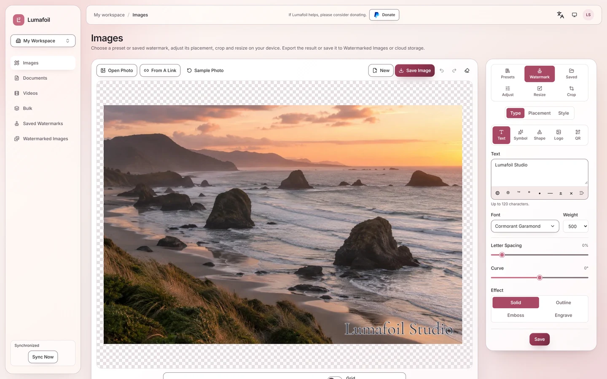
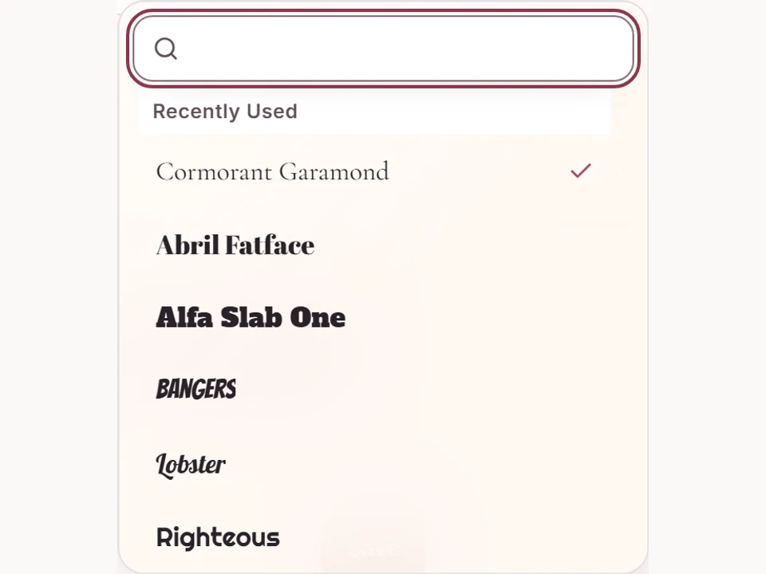
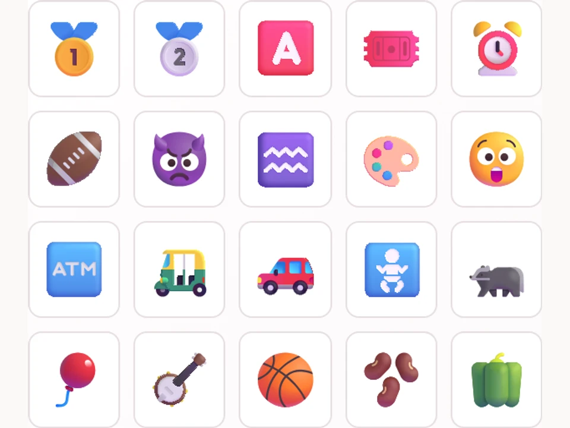
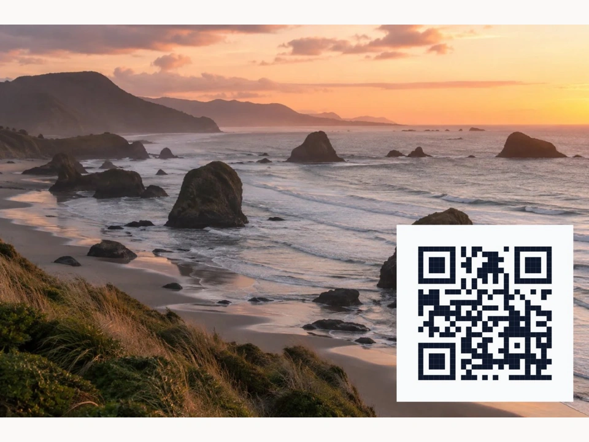
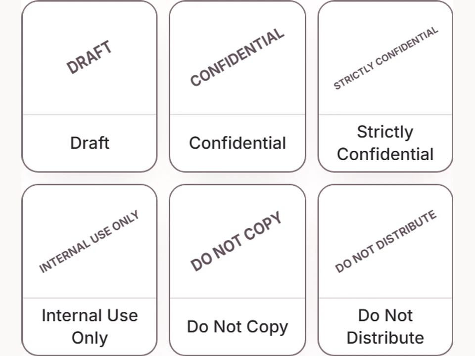

<p align="center">
  <picture>
    <source media="(prefers-color-scheme: dark)" srcset="public/brand/logo-light.svg">
    
  </picture>
</p>

<h1 align="center">Lumafoil</h1>

<p align="center">
  <strong>Watermark photos, PDFs, and supported videos in your browser.</strong>
  <br>
  Build reusable marks from text, logos, signatures, shapes, stickers, and QR codes.
</p>

<p align="center">
  <a href="https://lumafoil.com">Open Lumafoil</a>
  ·
  <a href="docs/self-hosting.md">Self-host</a>
  ·
  <a href="PLAN.md">Project status</a>
  ·
  <a href="SECURITY.md">Security</a>
</p>

<p align="center">
  <a href="LICENSE"></a>
  
  
  
</p>

<picture>
  <source media="(prefers-color-scheme: dark)" srcset="public/product/editor-dark.webp">
  
</picture>

<p align="center"><sub>Sample photography and disposable local data only.</sub></p>

> [!IMPORTANT]
> [lumafoil.com](https://lumafoil.com) is live and invitation-only. Source is
> available for self-hosting under the MIT license. Deployment is not the same as
> final release certification: Google Picker wiring, the complete current UI
> screenshot/axe and Lighthouse matrices, two-deployment offline upgrade proof,
> hardware-dependent encoding checks, and the final release tag remain open. See
> [PLAN.md](PLAN.md) and the [M19 verification record](docs/verification/m19/quality.md)
> for current evidence.

## What Lumafoil does

| Area                    | Shipped behavior                                                                                                                     |
| ----------------------- | ------------------------------------------------------------------------------------------------------------------------------------ |
| **Images**              | Edit one image or a batch; add layered marks; crop, resize, rotate, and adjust color; export PNG, JPEG, or WebP.                     |
| **PDFs**                | Preview pages, position marks, and export a watermarked PDF. Encrypted PDFs are refused, and documented size/page limits apply.      |
| **Videos**              | Place marks on a timeline with keyframes and fades. Export depends on browser WebCodecs and source/target codec support.             |
| **Reusable designs**    | Start from included presets or save custom text, logo, signature, shape, sticker, and QR designs in folders.                         |
| **Bulk work**           | Process mixed supported files, keep failures visible, and save outputs separately or together where the format permits.              |
| **Storage and sharing** | Optionally save finished images to a private workspace, organize them in folders, and create expiring or revocable links.            |
| **Cloud connections**   | Preview integrations for Google Drive, Dropbox, and OneDrive can open permitted files and save exports after explicit authorization. |
| **Interface**           | Light and dark themes, responsive layouts, twelve interface languages, and right-to-left Arabic.                                     |

Core editing and export run in the browser. Network features are explicit:
sign-in, workspace storage, link imports, cloud transfers, invitations, and
sharing use the server or selected provider. Original device files are not
changed.

## Product views

|                                Searchable font picker                                 |                                  Vector sticker library                                   |
| :-----------------------------------------------------------------------------------: | :---------------------------------------------------------------------------------------: |
|  |  |

|                             QR watermark                              |                                      Included presets                                       |
| :-------------------------------------------------------------------: | :-----------------------------------------------------------------------------------------: |
|  |  |

## Honest scope

- **Offline:** a signed-in user can prepare cached resources, edit saved
  watermarks, and queue supported photo saves for later synchronization. Account
  administration, sharing changes, and cloud transfers still need a connection.
  Full two-deployment upgrade/reconnect certification remains open.
- **Cloud storage:** integrations are marked preview. Core live provider flows
  have evidence, but the final native Google Picker wiring check remains open.
- **Video:** accepted containers, codecs, audio preservation, and output options
  depend on browser capabilities. Browser support is checked at runtime.
- **Accessibility:** responsive controls, keyboard paths, axe checks, and
  light/dark themes exist. Lumafoil does not claim complete WCAG certification
  while the current full UI matrix and contrast review remain open.
- **Release:** `package.json` identifies current source as `2.0.0`; no final 2.0
  release tag has been published. A production deployment does not close the
  remaining gates above.

## Quick start

Requirements:

- Node.js 24 (`.nvmrc`)
- npm 11.10 or newer (`min-release-age` support)
- Git

Install dependencies and create local configuration:

```bash
npm ci
cp .dev.vars.example .dev.vars
npm run db:migrate:local
npm run dev
```

PowerShell equivalent for the copy step:

```powershell
Copy-Item .dev.vars.example .dev.vars
```

Set `BETTER_AUTH_SECRET` in `.dev.vars` before starting. Development runs at
`http://localhost:5273`. Verification, reset, and invitation emails use the
console provider locally and appear in the Worker log.

For production bindings, email, OAuth providers, migrations, backups, and
deployment, follow the [self-hosting guide](docs/self-hosting.md) and
[runbook](docs/runbook.md).

## Architecture

| Layer               | Implementation                                                                        |
| ------------------- | ------------------------------------------------------------------------------------- |
| Client              | React, Vite, TanStack Router and Query, Tailwind CSS, Radix UI                        |
| Worker API          | Hono on Cloudflare Workers                                                            |
| Validation          | Strict TypeScript and shared Zod schemas                                              |
| Authentication      | Better Auth with server-enforced site and workspace roles                             |
| Data                | Cloudflare D1 through Drizzle ORM; private media in R2                                |
| Local/offline state | IndexedDB with account/workspace scoping and an operation outbox                      |
| Verification        | Vitest, workerd integration tests, Playwright with axe, Lighthouse, Semgrep, gitleaks |

```text
src/client/   React application, editors, browser engines, offline state
src/worker/   Hono API, auth, D1/R2 stores, cloud-provider routes
src/shared/   Runtime schemas, permissions, limits, shared types
e2e/          Playwright journeys across desktop, phone, and tablet profiles
scripts/      Build, deployment, security, performance, and visual gates
docs/         Plans, evidence, operations, threat model, and screenshots
```

## Verification

| Command                     | Purpose                                                                                                    |
| --------------------------- | ---------------------------------------------------------------------------------------------------------- |
| `npm run quality`           | Format, lint, types, dead code, cycles, duplication, secret/dependency checks, tests, and production build |
| `npm run test:e2e`          | Four-profile Playwright journeys with axe checks                                                           |
| `npm run security:sast`     | Semgrep security and correctness rulesets                                                                  |
| `npm run test:drill`        | Deliberate-failure drills proving named gates turn red                                                     |
| `npm run audit:lighthouse`  | Desktop/mobile performance and accessibility budgets                                                       |
| `npm run audit:screenshots` | English/Arabic, light/dark, responsive screenshot and axe inventory                                        |

`npm run quality` is necessary but does not include every release gate. Hosted
GitHub workflows are manual-only; local gates remain the default. Never infer a
pass from an unexecuted command—verification receipts and open work live in
[PLAN.md](PLAN.md).

## Privacy and security

- Image metadata is stripped by default. Explicit export settings can retain
  selected EXIF/XMP data; WebP exports remain stripped.
- Workspace media is private by default. Public gallery access requires an
  explicit share link that can expire or be revoked.
- Offline records and queued work are scoped to the originating account and
  workspace; server authorization is checked before synchronization.
- Inputs are validated at API boundaries, uploads are checked from file bytes,
  and API/static responses use restrictive security headers.

Report vulnerabilities privately through
[GitHub Security Advisories](https://github.com/RandyNorthrup/watermark-pro/security/advisories/new)
or the contact in [SECURITY.md](SECURITY.md). Do not open a public issue for a
security problem.

## Documentation

| Document                             | Use it for                                                         |
| ------------------------------------ | ------------------------------------------------------------------ |
| [PLAN.md](PLAN.md)                   | Current milestones, decisions, open gates, and evidence boundaries |
| [CHANGELOG.md](CHANGELOG.md)         | Changes that actually shipped                                      |
| [Self-hosting](docs/self-hosting.md) | Fresh instance setup and production configuration                  |
| [Runbook](docs/runbook.md)           | Deploy, backup, rollback, and incident operations                  |
| [Threat model](docs/threat-model.md) | Assets, trust boundaries, mitigations, and residual risks          |
| [SECURITY.md](SECURITY.md)           | Supported versions, controls, and vulnerability reporting          |

## License

Lumafoil application source is licensed under the [MIT License](LICENSE).
Bundled fonts, stickers, and other third-party assets keep their own licenses and
notices under `public/fonts/licenses`, `public/stickers`, and
`public/software-licenses`.
